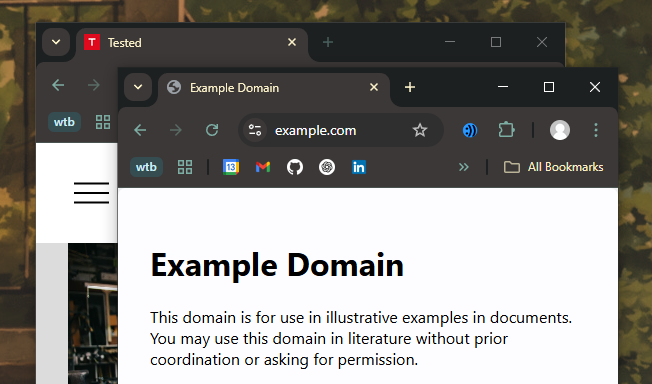
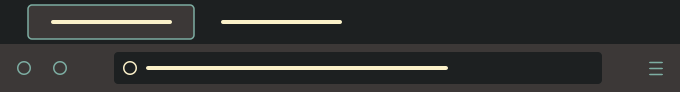
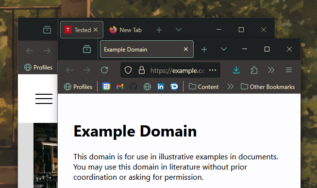

	

	
	

<h1 align="center">
	Gruvbox Material Theme
</h1>
	My take on a gruvbox theme for both Chrome & Firefox
 

<h2>Screenshots</h2>
<h3 align="center">Chrome</h3>
<h5><a href="https://chromewebstore.google.com/detail/pligoajaaggbghgopjdmkfbnaodknplm">Chrome Theme</a></h5>

	

<h3 align="center">FireFox
</h3>
<h5><a href="https://addons.mozilla.org/en-GB/firefox/addon/material-gruvbox-theme/">Firefox Theme</a></h5>

	
	 
	 
	

